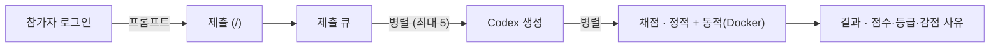

# vibe-security-score

부스용 **보안 코딩 챌린지 자동 채점기**. 참가자가 웹 UI에 프롬프트를 넣으면, 운영자의
ChatGPT(Codex CLI) 계정으로 Flask 게시판 앱을 생성하고, 그 코드를 격리 컨테이너에서 정적·동적
으로 자동 채점해 점수/등급을 보여준다. 참가자는 코드를 직접 만지지 않는다.



## 구성 (4파트)

| 파트 | 위치 | 역할 |
|---|---|---|
| 1. 웹 UI | `grader/submissions/` | 프롬프트 제출, 진행 폴링, 결과 화면, 운영자 대시보드 |
| 2. Codex 실행기 | `codex_runner/` | `codex exec`로 코드 생성 |
| 3. 채점 엔진 | `scoring/` | 정적(소스/의존성) + 동적(컨테이너 실공격) → 점수 |
| 4. 오케스트레이터 | `grader/submissions/orchestrator/` | 제출 큐, 병렬 생성(최대 5) / 병렬 채점 |

- 채점기 = **Django**, 참가자 생성 앱 = **Flask**(채점 대상), 참가자 앱 실행 =
  **`python:3.11-slim` 격리 컨테이너**(비루트·자원제한·네트워크 유지).
- 모든 가중치·임계값·감점·게이트·도구 설정은 **`config/scoring.yaml`** 한 곳에.
- 설계 상세: [docs/ARCHITECTURE.md](docs/ARCHITECTURE.md) · 앱 계약: [docs/APP_CONTRACT.md](docs/APP_CONTRACT.md)

## 요구 사항

- Python 3.11+, [uv](https://docs.astral.sh/uv/)
- **Docker** — 채점의 기본 전제(참가자 앱을 샌드박스로 실행)
- 외부 보안 도구 `osv-scanner`·`gitleaks`·`semgrep`·`sqlmap` (아래 참고)
- Codex CLI + 운영자 ChatGPT(Pro) 로그인 — **코드 생성에만**

## 설치 (개발)

```bash
uv sync                                              # 의존성 (.venv 생성 + 설치)
docker build -t vibe-sec-sandbox:latest sandbox/     # 참가자 앱 실행용 샌드박스 이미지
cd grader
uv run python manage.py migrate
uv run python manage.py createsuperuser              # 운영자 대시보드 로그인용
```

uv가 없다면 `curl -LsSf https://astral.sh/uv/install.sh | sh`

## 외부 보안 도구

기본 채점은 `osv-scanner`·`gitleaks`·`semgrep`·`sqlmap`이 **설치돼 있어야 돌아간다**(하나라도
없으면 에러로 중단). 설치 없이 내장 검사로 돌리려면 `--dev`(개발용, 권장 안 함).

```bash
# macOS
brew install go osv-scanner gitleaks semgrep sqlmap

# Linux
sudo apt install -y golang-go pipx
go install github.com/google/osv-scanner/cmd/osv-scanner@latest
go install github.com/gitleaks/gitleaks/v8@latest
pipx install semgrep sqlmap
export PATH="$PATH:$(go env GOPATH)/bin"
```

## 실행 (개발)

```bash
cd grader
uv run python manage.py runserver    # 참가자 UI: http://127.0.0.1:8000/ · 대시보드: /admin/
uv run python manage.py run_worker   # (별도 프로세스) 제출 처리: 생성→채점 (시작 시 고아 자원 정리)
```

## 접근 제어 (공개 배포)

회원가입 없음. 페이지·진행/결과는 로그인 없이 열람 가능(부스 스크린용)하지만 **제출은 로그인
필수** — 익명 POST는 로그인으로 리다이렉트된다. 계정은 운영자가 만든다. 세션은 **16시간** 유지
(부스 노트북에서 아침 로그인 한 번으로 10시간 넘는 부스 하루를 재로그인 없이 커버).
비밀번호 정책은 없다(운영자가 원하면 `AUTH_PASSWORD_VALIDATORS`로 추가).

```bash
cd grader
uv run python manage.py createsuperuser              # 운영자(staff): 관리·재채점 가능
# 일반 제출 계정: /admin/ → Operators → 추가, 또는:
uv run python manage.py shell -c "from django.contrib.auth import get_user_model as G; \
G().objects.create_user(username='booth1', password='<비밀번호>')"
```

- **운영자(staff)**: 우측 상단 `이름 · 운영자` + `관리`(/admin/), 결과 페이지에 **재채점** 버튼
  (기존 생성 코드를 Codex 재호출 없이 다시 채점 — scoring.yaml 변경 후 재평가에 유용). 생성 코드가
  없는 제출(생성 실패)은 재채점으로 복구되지 않아 **재제출**해야 한다.
- **일반 계정**: 제출만 가능. 순위(`/ranking/`)는 로그인 없이 공개.

## 채점기 단독 실행 (Codex 없이)

커밋된 샘플 앱으로 채점 파이프라인 확인(외부 도구 설치 전제). `vulnerable_board`=방어 얕음(낮은
점수), `secure_board`=하드닝(높은 점수). 도구 미설치면 `--dev`(내장 검사, 개발용):

```bash
python -m scoring.cli static samples/vulnerable_board   # 정적만
python -m scoring.cli grade  samples/vulnerable_board   # 정적 + 동적(Docker)
python -m scoring.cli grade  samples/secure_board
```

## 테스트

```bash
uv run pytest scoring codex_runner            # 채점 엔진 + Codex 실행기 (Docker 있으면 동적 통합 포함)
cd grader && uv run python manage.py test     # 웹 UI + 오케스트레이터
```

Codex 실제 생성 테스트(설치·로그인 시). **Windows는 WSL(Ubuntu) 안에서** — Codex 샌드박스는
Linux/macOS만 지원. Windows용 codex를 WSL이 집으면 `node: not found`로 실패하니 Node·codex를
WSL 네이티브로 설치한다:

```bash
# WSL(Ubuntu/Debian) 안에서 (--include=optional 이 핵심:
# 플랫폼 바이너리 @openai/codex-linux-x64 가 optionalDependency 라 빠지면 실행 실패)
curl -fsSL https://deb.nodesource.com/setup_22.x | sudo -E bash - && sudo apt install -y nodejs
sudo npm install -g @openai/codex@latest --include=optional
codex login          # 헤드리스: codex login --device-auth
uv run python -m codex_runner.smoke
```

## 설정 · 운영 주의

- `config/scoring.yaml` — 가중치·임계값·감점·게이트 캡·등급 컷·컨테이너 제한·Codex 플래그·외부
  도구·오케스트레이터 동시성(`generation_concurrency`/`scoring_concurrency`)·재시도.
  `config/default_prompt.md` — 고정 시스템 프롬프트(앱 스펙). `data/` — 재현성용 고정 스냅샷.
- **Codex 인증·모델**: 코드 생성은 `codex login`한 **운영자 ChatGPT 세션(OAuth)** 만 사용
  (`OPENAI_API_KEY`/`CODEX_API_KEY`는 비움). 생성 모델은 config 기본값을 쓰되 **admin `채점기 설정`
  에서 런타임 변경** 가능. 생성은 `generation_concurrency`(기본 5)까지 병렬 처리된다.
- **프로덕션(Ubuntu)**: gunicorn + systemd + nginx + **PostgreSQL**(병렬 쓰기). 전체 절차는
  [deploy/README.md](deploy/README.md).
