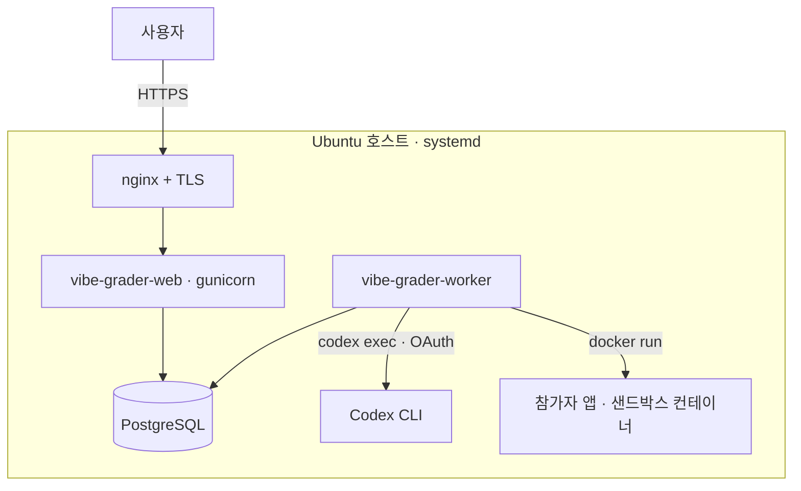

# 프로덕션 배포 (Ubuntu)

채점기는 **네이티브(systemd)**로 돌리고 참가자 앱만 Docker 컨테이너로 띄운다 — 채점기 프로세스가
호스트 Docker 데몬에 접근할 수 있어야 한다(Docker-in-Docker 불필요). systemd 프로세스 2개:
`vibe-grader-web`(gunicorn, 참가자 UI + `/admin`), `vibe-grader-worker`(제출 파이프라인: 병렬
생성 → 병렬 채점, 시작 시 고아 자원 정리).



`/opt/vibe-security-score` 아래(코드·`.venv`·DB·생성물)는 전부 **`vibe`가 소유·실행**한다. 그래서
앱 작업(uv·docker build·manage.py·codex)은 **vibe 로그인 셸 안에서 한꺼번에**(5장) 돌린다 — root로
만든 `.venv`는 나중에 vibe가 지우지 못해 깨진다. `apt`·`/etc`·systemd·nginx 같은 시스템 작업만
root(`sudo`)로 한다.

## 0. 사전 패키지

```bash
sudo apt update
sudo apt install -y docker.io postgresql nginx git curl
curl -LsSf https://astral.sh/uv/install.sh | sudo env UV_INSTALL_DIR=/usr/local/bin sh
```

## 1. 사용자 + 코드

서비스 계정(홈 = 코드 경로)을 만들고 저장소를 그 안에 클론한다. `useradd -m`은 홈을 스켈레톤
(`.bashrc` 등)으로 채워 이후 `git clone`이 "not empty"로 실패하므로 **쓰지 않는다** — root로 클론한
뒤 소유권을 넘긴다(`/opt`는 root만 쓸 수 있어 클론 자체를 vibe로 하면 디렉터리 생성이 막힌다).

```bash
sudo useradd -r -s /bin/bash -d /opt/vibe-security-score vibe
sudo usermod -aG docker vibe
sudo git clone https://github.com/Nekonic/vibe-security-score.git /opt/vibe-security-score
sudo chown -R vibe:vibe /opt/vibe-security-score
```

## 2. 채점 외부 도구 (필수)

기본 채점 모드는 `osv-scanner`·`gitleaks`·`semgrep`·`sqlmap`을 **요구**한다(하나라도 없으면
채점이 중단됨). 워커는 systemd로 돌아 기본 PATH만 보므로 **`/usr/local/bin`에 설치**한다.

```bash
sudo apt install -y golang-go pipx
sudo env GOBIN=/usr/local/bin go install github.com/google/osv-scanner/cmd/osv-scanner@latest
sudo env GOBIN=/usr/local/bin go install github.com/gitleaks/gitleaks/v8@latest
sudo pipx install --global semgrep && sudo pipx install --global sqlmap
# 확인 (워커와 같은 PATH에서 잡혀야 함)
for t in osv-scanner gitleaks semgrep sqlmap; do command -v "$t" || echo "MISSING: $t"; done
```
> 도구를 설치하지 않을 거라면 `config/scoring.yaml`의 `tools.*.enabled`를 끄거나 `--dev`
> 내장 검사로만 돌려야 하지만, **실채점에는 권장하지 않는다**.

## 3. PostgreSQL

아래 `PASSWORD`는 4장 env의 `DJANGO_DB_PASSWORD`와 **똑같이** 정한다(다르면 마이그레이션이
`FATAL: password authentication failed`로 막힌다). 나중에 바꾸려면
`sudo -u postgres psql -c "ALTER USER vibe PASSWORD '새비번';"`.

```bash
sudo -u postgres psql <<'SQL'
CREATE USER vibe WITH PASSWORD 'CHANGE-ME';
CREATE DATABASE vibe_grader OWNER vibe;
SQL
```

## 4. 환경 파일

```bash
sudo cp /opt/vibe-security-score/deploy/vibe-grader.env.example /etc/vibe-grader.env
sudo chown vibe:vibe /etc/vibe-grader.env && sudo chmod 600 /etc/vibe-grader.env
sudo vi /etc/vibe-grader.env      # SECRET_KEY, ALLOWED_HOSTS, DB 비밀번호 등 수정
```
- `DJANGO_DB_PASSWORD` = 3장에서 정한 Postgres `vibe` 롤 비밀번호와 동일해야 한다.
- `DJANGO_SECRET_KEY` 생성: `python3 -c "import secrets; print(secrets.token_urlsafe(64))"`

## 5. 앱 셋업 (vibe로) — 파이썬 · 이미지 · Codex

vibe 로그인 셸에서 처리한다(여기서는 DB env가 필요 없다). 저장소의 `.python-version`이
**Python 3.12**를 고정한다 — 3.13/3.14엔 psycopg 바이너리 휠이 아직 없어 `ModuleNotFoundError:
psycopg`로 깨진다.

```bash
sudo -i -u vibe                                # vibe 로그인 셸
cd /opt/vibe-security-score

# 파이썬 환경 (uv sync엔 항상 --extra prod — 빼면 psycopg/gunicorn이 제거된다)
uv python install 3.12
uv sync --extra prod --no-dev

# Docker 이미지: 샌드박스(참가자 앱 실행, 채점 필수) + 공격(운영자 PoC 콘솔)
docker build -t vibe-sec-sandbox:latest sandbox/
docker build -f sandbox/attack/Dockerfile -t vibe-sec-attack:latest .

# Codex 로그인 (ChatGPT 계정, API 키 아님). vibe 홈이 코드 경로라 ~/.codex = env의 CODEX_HOME
codex login                                    # 헤드리스면: codex login --device-auth
codex --version

exit
```
생성 모델은 배포 후 `/admin`의 **채점기 설정**에서 바꾼다(config 재배포·재시작 불필요).

## 6. DB 마이그레이션 · 정적 파일 · 관리자 계정

vibe 셸에서 env 파일을 로드하고 실행한다(서비스가 `EnvironmentFile`로 읽는 것과 같은 파일 —
영숫자 값이면 파싱 결과도 동일하다).

```bash
sudo -i -u vibe
set -a; source /etc/vibe-grader.env; set +a
cd /opt/vibe-security-score/grader
uv run python3 manage.py migrate
uv run python3 manage.py collectstatic --noinput
uv run python3 manage.py createsuperuser
exit
```

## 7. systemd 서비스

```bash
sudo cp /opt/vibe-security-score/deploy/systemd/vibe-grader-*.service /etc/systemd/system/
sudo systemctl daemon-reload
sudo systemctl enable --now vibe-grader-web vibe-grader-worker
systemctl status vibe-grader-web vibe-grader-worker
```

## 8. nginx + TLS

`listen 80`인 채로 두고 **`server_name`만 실제 도메인으로** 바꾼다. TLS(`listen 443 ssl` + 인증서)는
**certbot이 자동으로 추가**한다 — 수동으로 `listen 443`을 넣으면 인증서·`ssl` 없이 443에서 평문
HTTP를 응답해 `curl`이 `wrong version number`로 깨진다. certbot 전에 도메인 A레코드가 이 서버를
가리키고(`dig +short <도메인>`) 80·443 인바운드가 열려 있어야 한다.

```bash
sudo cp /opt/vibe-security-score/deploy/nginx/vibe-grader.conf /etc/nginx/sites-available/vibe-grader
sudo ln -s /etc/nginx/sites-available/vibe-grader /etc/nginx/sites-enabled/
sudo vi /etc/nginx/sites-available/vibe-grader   # server_name + static alias 경로만 수정 (listen 80 유지)
sudo nginx -t && sudo systemctl reload nginx
sudo apt install -y certbot python3-certbot-nginx
sudo certbot --nginx -d nekonic.cloud            # 인증서 발급 + listen 443 ssl 블록 + 80->443 자동 구성
```

## 9. 확인

```bash
curl -I https://grader.example.com/                 # 200
journalctl -u vibe-grader-worker -f                 # 워커 로그
```
웹 UI(`/`)에서 제출을 넣고 상태가 queued → generating → scoring → done 으로 흐르는지,
컨테이너가 남지 않는지(`docker ps -a`) 확인.

## 운영

- **로그**: `journalctl -u vibe-grader-web|worker`
- **설정 변경**(가중치/임계값 등): `config/scoring.yaml` 수정 후
  `sudo systemctl restart vibe-grader-worker` (채점 로직이 다시 읽음)
- **업데이트 배포**: 앱 갱신·마이그레이션은 vibe 셸에서, 재시작만 root로.
  ```bash
  sudo -i -u vibe
  set -a; source /etc/vibe-grader.env; set +a
  cd /opt/vibe-security-score
  git pull
  uv sync --extra prod --no-dev
  cd grader
  uv run python3 manage.py migrate
  uv run python3 manage.py collectstatic --noinput
  exit
  sudo systemctl restart vibe-grader-web vibe-grader-worker
  ```
  `sandbox/`(entrypoint·Dockerfile·sitecustomize) 또는 `sandbox/attack/`가 바뀐 업데이트면 vibe 셸에서
  해당 이미지를 다시 빌드한다(5장) — 재시작만으론 반영되지 않는다.
- **Codex 세션 만료**: 워커가 감지해 `journalctl`에 `OPERATOR ALERT` 로그를 남긴다. vibe 셸에서
  `codex login`으로 재로그인한 뒤, 해당 제출을 **다시 제출**한다. (결과 페이지의 **재채점**은
  기존 생성 코드를 다시 채점할 뿐 Codex를 재호출하지 않으므로, 생성 자체가 실패해 코드가 없는
  제출은 재채점으로 복구되지 않는다.)
