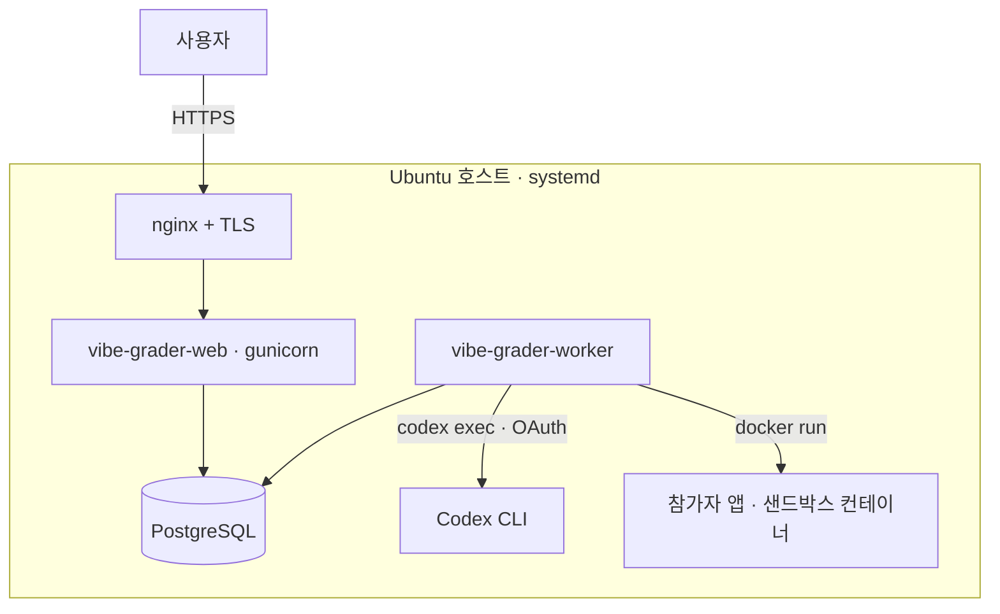

# 프로덕션 배포 (Ubuntu)

채점기는 **네이티브(systemd)**로 돌리고 참가자 앱만 Docker 컨테이너로 띄운다 — 채점기 프로세스가
호스트 Docker 데몬에 접근할 수 있어야 한다(Docker-in-Docker 불필요). systemd 프로세스 2개:
`vibe-grader-web`(gunicorn, 참가자 UI + `/admin`), `vibe-grader-worker`(제출 파이프라인: 병렬
생성 → 병렬 채점, 시작 시 고아 자원 정리).



## 0. 사전 패키지

```bash
sudo apt update
sudo apt install -y docker.io postgresql nginx git curl
curl -LsSf https://astral.sh/uv/install.sh | sudo env UV_INSTALL_DIR=/usr/local/bin sh
```

## 1. 사용자 + 코드

서비스 계정(홈 = 코드 경로)을 만들고 저장소를 그 안에 클론한다. `useradd -m`은 홈을 스켈레톤
(`.bashrc` 등)으로 채워 이후 `git clone`이 "not empty"로 실패하므로 **쓰지 않는다** — root로 클론한
뒤 소유권을 넘긴다(`/opt`는 root만 쓸 수 있어 클론 자체를 vibe로 하면 디렉터리 생성이 막힌다).

```bash
sudo useradd -r -s /bin/bash -d /opt/vibe-security-score vibe
sudo usermod -aG docker vibe
sudo git clone https://github.com/Nekonic/vibe-security-score.git /opt/vibe-security-score
sudo chown -R vibe:vibe /opt/vibe-security-score
cd /opt/vibe-security-score
```

## 2. 파이썬 환경 (uv)

저장소의 `.python-version`이 **Python 3.12**를 고정한다 — psycopg 같은 바이너리 휠이 확실히 있는
버전이다. 시스템 파이썬이 3.13/3.14면 그 휠이 아직 없어 `psycopg` 설치가 조용히 누락되고
마이그레이션이 `ModuleNotFoundError: psycopg`로 깨진다. uv가 3.12를 내려받아 venv를 만든다.

```bash
sudo -u vibe uv python install 3.12
sudo -u vibe uv sync --extra prod --no-dev
```

## 3. Docker 이미지 빌드

참가자 앱을 격리 실행하는 **샌드박스** 이미지(채점 필수)와, 운영자 PoC 콘솔이 공격 코드를
격리 실행하는 **공격** 이미지(결과 페이지의 PoC 데모용) 둘 다 빌드한다.

```bash
sudo -u vibe docker build -t vibe-sec-sandbox:latest sandbox/
sudo -u vibe docker build -f sandbox/attack/Dockerfile -t vibe-sec-attack:latest .
```

## 3.5 채점 외부 도구 (필수)

기본 채점 모드는 `osv-scanner`·`gitleaks`·`semgrep`·`sqlmap`을 **요구**한다(하나라도 없으면
채점이 중단됨). 워커는 systemd로 돌아 기본 PATH만 보므로 **`/usr/local/bin`에 설치**한다.

```bash
sudo apt install -y golang-go pipx
sudo env GOBIN=/usr/local/bin go install github.com/google/osv-scanner/cmd/osv-scanner@latest
sudo env GOBIN=/usr/local/bin go install github.com/gitleaks/gitleaks/v8@latest
sudo pipx install --global semgrep && sudo pipx install --global sqlmap
# 확인 (워커와 같은 PATH에서 잡혀야 함)
for t in osv-scanner gitleaks semgrep sqlmap; do command -v "$t" || echo "MISSING: $t"; done
```
> 도구를 설치하지 않을 거라면 `config/scoring.yaml`의 `tools.*.enabled`를 끄거나 `--dev`
> 내장 검사로만 돌려야 하지만, **실채점에는 권장하지 않는다**.

## 4. PostgreSQL

```bash
sudo -u postgres psql <<'SQL'
CREATE USER vibe WITH PASSWORD 'CHANGE-ME';
CREATE DATABASE vibe_grader OWNER vibe;
SQL
```

## 5. 환경 파일

```bash
sudo cp deploy/vibe-grader.env.example /etc/vibe-grader.env
sudo chown vibe:vibe /etc/vibe-grader.env && sudo chmod 600 /etc/vibe-grader.env
vi /etc/vibe-grader.env      # SECRET_KEY, ALLOWED_HOSTS, DB 비밀번호 등 수정
```
`DJANGO_SECRET_KEY` 생성: `python3 -c "import secrets; print(secrets.token_urlsafe(64))"`

## 6. DB 마이그레이션 · 정적 파일 · 관리자 계정

`vibe` 셸을 열어 env 파일을 **셸 안에서 직접** 로드한다. `sudo --preserve-env`는 기본 sudoers
정책(`env_reset`)에 막혀 무시되므로, 바깥 셸에서 `source`한 값이 vibe 프로세스로 넘어가지 않는다
(그대로 두면 DB 설정이 안 실려 sqlite 기본값으로 마이그레이트된다). env 파일은 vibe 소유라 vibe가 읽는다.

```bash
sudo -u vibe bash        # 이하 명령은 vibe 셸 안에서 실행
set -a; source /etc/vibe-grader.env; set +a
cd /opt/vibe-security-score/grader
uv run python3 manage.py migrate
uv run python3 manage.py collectstatic --noinput
uv run python3 manage.py createsuperuser
exit
```

## 7. Codex 로그인 (코드 생성 인증)

`vibe` 사용자로, 환경 파일의 `CODEX_HOME` 아래에 ChatGPT 계정으로 로그인한다(API 키 아님).

```bash
sudo -u vibe CODEX_HOME=/opt/vibe-security-score/.codex codex login   # 헤드리스면 codex login --device-auth
sudo -u vibe CODEX_HOME=/opt/vibe-security-score/.codex codex --version
```
그런 다음 `config/scoring.yaml`의 `codex.model` / 플래그가 설치된 CLI와 맞는지 확인. 생성 모델은
배포 후 `/admin`의 **채점기 설정**에서 바꿀 수 있다(config 재배포·재시작 불필요).

## 8. systemd 서비스

```bash
sudo cp deploy/systemd/vibe-grader-*.service /etc/systemd/system/
sudo systemctl daemon-reload
sudo systemctl enable --now vibe-grader-web vibe-grader-worker
systemctl status vibe-grader-web vibe-grader-worker
```

## 9. nginx + TLS

```bash
sudo cp deploy/nginx/vibe-grader.conf /etc/nginx/sites-available/vibe-grader
sudo ln -s /etc/nginx/sites-available/vibe-grader /etc/nginx/sites-enabled/
# server_name / static alias 경로를 실제 값으로 수정
sudo nginx -t && sudo systemctl reload nginx
sudo apt install -y certbot python3-certbot-nginx
sudo certbot --nginx -d grader.example.com          # 80 -> 443 자동 구성
```

## 10. 확인

```bash
curl -I https://grader.example.com/                 # 200
journalctl -u vibe-grader-worker -f                 # 워커 로그
```
웹 UI(`/`)에서 제출을 넣고 상태가 queued → generating → scoring → done 으로 흐르는지,
컨테이너가 남지 않는지(`docker ps -a`) 확인.

## 운영

- **로그**: `journalctl -u vibe-grader-web|worker`
- **설정 변경**(가중치/임계값 등): `config/scoring.yaml` 수정 후
  `sudo systemctl restart vibe-grader-worker` (채점 로직이 다시 읽음)
- **업데이트 배포**:
  ```bash
  cd /opt/vibe-security-score && sudo -u vibe git pull
  sudo -u vibe uv sync --extra prod --no-dev
  sudo -u vibe bash -c 'set -a; source /etc/vibe-grader.env; set +a; \
    cd /opt/vibe-security-score/grader && \
    uv run python3 manage.py migrate && \
    uv run python3 manage.py collectstatic --noinput'
  sudo systemctl restart vibe-grader-web vibe-grader-worker
  ```
  `sandbox/`(entrypoint·Dockerfile·sitecustomize) 또는 `sandbox/attack/`가 바뀐 업데이트면 해당
  이미지를 다시 빌드한다(3장) — 재시작만으론 반영되지 않는다.
- **Codex 세션 만료**: 워커가 감지해 `journalctl`에 `OPERATOR ALERT` 로그를 남긴다.
  `codex login`으로 재로그인한 뒤, 해당 제출을 **다시 제출**한다. (결과 페이지의 **재채점**은
  기존 생성 코드를 다시 채점할 뿐 Codex를 재호출하지 않으므로, 생성 자체가 실패해 코드가 없는
  제출은 재채점으로 복구되지 않는다.)
