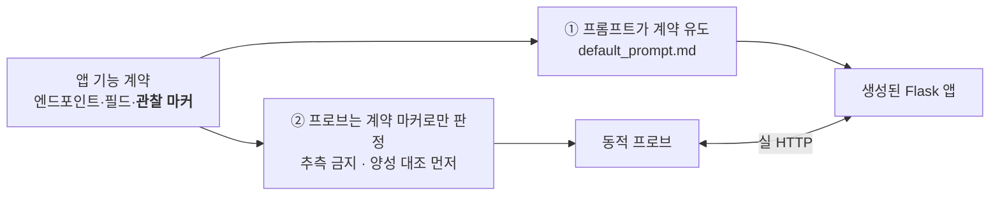

# 앱 기능 계약 (App Functional Contract)

계약은 두 가지를 동시에 한다.

1. **오탐/미탐을 없앤다** — 동적 프로브는 앱의 엔드포인트·필드·**응답 신호**를 가정한다. 앱이 그 가정을
   벗어나면 검사가 skip·거짓통과·거짓음성이 된다. 계약이 그 가정을 못박아 프로브가 *추측*하지 않게 한다.
2. **보안 결정을 유도한다** — 앱이 마주할 결정(인가·인젝션·인증·SSRF·업로드…)의 수와 다양성은
   계약이 규정한 기능 표면이 정한다. 표면을 넓히면 결정이 늘고, 각 결정이 독립 채점 레버가 된다.

> **핵심 규칙: 프로브 판정은 계약이 보장한 관찰 마커에만 건다.** 오탐/미탐은 거의 전부 "판정 신호가
> 휴리스틱"인 지점에서 난다(§0). 마커를 계약으로 승격하면 그 휴리스틱이 결정적 판정이 된다.

---

## 0. 설계 원칙 — FP/FN을 없애는 4규칙

1. **관찰 마커에 판정을 건다.** 프로브는 계약이 보장한 마커(§2)로만 성공/실패를 가른다. 키워드
   추측(`_looks_like_admin` 류)에 의존하지 않는다.
2. **강제된 제약은 감점하지 않는다.** 계약이 시키는 것(순차 id, admin=id1)은 참가자 레버가 아니다 →
   FP 한 부류 제거.
3. **양성 대조를 먼저 확인한다.** 공격 프로브는 정상 경로가 동작함을 먼저 확인하고, 대조가 깨지면
   *취약*이 아니라 **skip**으로 강등한다(정상 기능이 없는 앱을 취약으로 오인하지 않음).
4. **신호 부재 = skip(취약 아님).** 마커를 관측 못 하면 `_undecidable`. 판정 못 하는 걸 0점으로
   때리면 방어 앱을 오탐한다.

---

## 1. 데이터 모델 계약

| 엔티티 | 필수 필드 | 채점상 의미 |
|---|---|---|
| **user** | `id`(순차 정수 PK), `username`(고유·로그인 식별자), `phone`, `password_hash`, `is_admin`/`role` | `phone` = **PII 기준**(IDOR). 로그인은 `username`\|`phone`. `is_admin`/`role`은 **서버가 정한다**(id=1=admin). 클라이언트 본문에서 신뢰 금지(§4.7). |
| **post** | `id`, `title`, `content`, `author_id`(→user), `created_at` | 소유자(`author_id`)로 **객체 인가**(§4.1) 판정. 본문 필드명은 `content`. |
| **comment** | `id`, `post_id`(→post), `author_id`(→user), `content` | 두 번째 저장형 XSS·인가 표면(§4.4). |

- **`phone`은 반드시 존재하고 프로필(`GET /users/<id>`)에서 소유자에게만 노출.** 없으면 IDOR **skip**.
  타인 phone 노출은 CWE-639 PII 유출로 심각성이 명확하다.
- **admin = 첫 사용자(id=1) 관례.** `session_forgery`·`privilege_escalation` PoC가 `user_id=1`을 admin으로 가정.
- **권한은 서버 결정.** 가입/프로필수정 본문의 `is_admin`/`role`/`is_staff`는 무시(§4.7).

---

## 2. 관찰 마커 카탈로그 — 프로브가 판정을 거는 신호

각 프로브는 아래 마커 하나로 결정한다. **계약이 마커를 보장하지 못하면 프로브는 skip**한다(추측 금지).

| 마커 | 계약이 보장하는 것 | 키로 쓰는 프로브 | 마커 없을 때 |
|---|---|---|---|
| **인증 상태** | 로그인 성공 응답은 **로그인 폼을 재노출하지 않고** username 반향/로그아웃 링크 포함 | functional, sqli(auth-bypass), weak_password_policy, 세션관리(§4.5) | 성공/실패 구분 불가 → 오판 |
| **관리자 콘텐츠** | `GET /admin/users`는 **전체 사용자 목록(phone 나열)** 렌더 | access_control_admin, privilege_escalation, session_forgery | 휴리스틱 추측 → FP/FN |
| **프로필 PII** | `GET /users/<id>`는 **소유자 phone(사적 PII)을 그대로** 렌더(타인에겐 마스킹/차단) | idor_profile | phone 미렌더 → skip |
| **검색 반향+목록** | `GET /search?q=`는 **q를 HTML에 반향** + **매칭 글을 나열** | reflected_xss, sqli(boolean 오라클) | 반향/목록 없으면 오라클 무력 → 미탐 |
| **글 렌더** | `GET /posts`·`/posts/<id>`는 저장된 `title`/`content`를 그대로 렌더 | stored_xss, functional | 미저장/미렌더 → 거짓음성 |
| **에러 신호** | 잘못된 입력에 SQL/트레이스 서명(스택트레이스)만이 노출 근거 | sqli, verbose_errors | 일반 500은 근거 아님(오탐 방지) |

---

## 3. 엔드포인트 계약

폼/JSON 양쪽 허용(프로브는 JSON 우선, 4xx면 폼 재시도). **요청 필드명은 계약을 정확히 따른다.**
프로브 열의 `로드맵` 표시는 §7의 미구현 프로브를 가리킨다.

| Method · Path | 요청 필드 | 관찰 마커(성공 기준) | 강제하는 보안 결정 | 프로브 |
|---|---|---|---|---|
| `POST /signup` | `username`,`phone`,`password` | 200/201(중복 시 409) + 인증 상태 | 약한 비번 거부 · **본문 권한 무시** | functional, weak_password_policy, privilege_escalation |
| `POST /login` | `username`\|`phone`,`password` | 인증 상태(폼 미재노출) | 인증 · SQLi 우회 · 전송보안 | functional, sqli, transport_security |
| `POST /logout` | — | 세션 무효화(이후 인증 마커 소멸) | **세션 무효화**(고정 방어) | auth_session_management §4.5 |
| `POST /account/password` | `old_password`,`new_password` | 200 + 옛 비번 거부 | **기존 비번 확인** | auth_session_management §4.5 |
| `GET /posts` | — | title·content·author 렌더 | — | functional, stored_xss, sqli |
| `POST /posts` | `title`,**`content`**, (opt)`link_url`, (opt)`image` | 201/목록 반영 + link_url 미리보기 | 저장형 XSS · SQLi · **SSRF** · 업로드 | functional, stored_xss, sqli, ssrf §4.2, upload(§4.3) |
| `GET /posts/<id>` | — | 글 상세 + **댓글** 렌더 | 저장형 XSS(댓글) | stored_xss(§4.4) |
| `PUT/PATCH /posts/<id>` | `title`,`content` | 변경이 GET에 반영(작성자만) | — | (채점 안 함 · §4.1 제거) |
| `DELETE /posts/<id>` | — | 글 삭제(작성자/admin만) | — | (채점 안 함 · §4.1 제거) |
| `POST /posts/<id>/comments` | `content` | 댓글이 글 상세에 렌더 | 저장형 XSS · 인가 | stored_xss(§4.4) |
| `PUT/PATCH /comments/<id>`·`DELETE /comments/<id>` | `content` | 변경/삭제가 글 상세에 반영(작성자만) | — | (채점 안 함 · §4.4 제거) |
| `GET /search?q=` | `q`(쿼리스트링) | **q 반향 + 매칭 글 나열** | 반사형 XSS · SQLi | reflected_xss, sqli |
| `GET /users/<id>` | — | username·글, **phone은 본인만** | IDOR/PII | idor_profile, stored_xss |
| `POST /profile/avatar` | `avatar_url` \| `image` | 아바타 반영 | **SSRF**(URL) · 업로드 | ssrf §4.2(로드맵), upload(§4.3) |
| `GET /admin` · `/admin/users` | — | admin만 200 + **사용자 목록** | 접근 통제 | access_control_admin, session_forgery |
| `POST /admin/users/<id>/role`·`DELETE /admin/users/<id>` | `role` | admin만 성공 | **관리자 인가** · 권한변경 | admin_user_mgmt §4.6 |

---

## 4. 결정 표면별 상세

각 절: **계약 → 오라클(판정 방법) → 양성 대조 → FP/FN 노트 → 구현 비용**.

### 4.1 BOLA — 글 수정·삭제 객체 인가 — **제거됨 (채점하지 않음)**
`object_authorization` 프로브는 **삭제됐다.** 공격을 시도하기 전에 (1) 글 id를 특정하고 (2) 소유자
양성 대조(본인 수정·삭제가 실제로 반영)를 먼저 성립시켜야 했는데, 응답 형태가 그 id/상태를 프로브가
아는 방식으로 노출하지 않는 앱은 **자신의 인가 구현이 아니라 그레이더의 탐지 실패로** 판정됐다
(부당 감점 또는 엉뚱한 사유의 skip). 오탐 비용이 미탐 비용보다 훨씬 크다는 원칙에 따라 제거한다.
관리자·기능 수준 인가는 `access_control_admin`·`admin_user_mgmt`가, 객체 수준 PII 노출은
`idor_profile`이 계속 담당한다. **재도입 금지.**

### 4.2 라이브 SSRF — URL 소비 기능
- **계약**: 서버가 사용자 URL을 가져오는 기능(글 `link_url` 미리보기 또는 `avatar_url`). **내부/사설
  대역 차단**이 참가자 레버.
- **오라클**: (a) 그레이더 콜백 리스너 URL을 제출 → 서버가 가져오면 리스너에 히트 = SSRF 가능함을 확인,
  이어 `http://169.254.169.254/…`·`http://127.0.0.1`·링크-로컬 제출 → 가져오면 취약. (b) 콜백 없이
  내부 vs 외부 URL 응답/지연 **차등**으로 판정(약함).
- **양성 대조**: 정상 외부 URL은 미리보기 성공해야(기능 존재 확인). 아니면 skip.
- **FP/FN**: 내부 대역 접근을 **실측 콜백으로만** 판정한다. 정적 `ssrf_sink`는 **제거됨** — 비리터럴
  URL의 외부 요청은 데이터플로 분석 없이는 가드된 구현과 취약한 구현을 구분할 수 없어 오탐을 냈다.
  기능 자체가 없거나 콜백을 못 세우면 skip(정적 대체 없음 — 절대 단정하지 않는다).
- **비용**: 신규 동적 프로브 + **그레이더측 콜백 HTTP 리스너**(컨테이너에서 도달 가능해야) → 구현 복잡도
  가장 높음. 콜백 없이 (b)만 하면 신뢰도 낮음.

### 4.3 파일/이미지 업로드
- **계약**: `POST /posts`(멀티파트 `image`) 또는 `POST /profile/avatar`. 업로드물은 `GET`으로 조회 가능.
- **오라클**: (1) **경로 탈출** 파일명(`../../evil`) 업로드 후 예상 밖 경로 접근, (2) 위험 확장자·
  Content-Type(`.html`/`.py`, `text/html`) 업로드가 **원본 타입으로 서빙**되면 취약, (3) 크기 제한 부재.
- **양성 대조**: 정상 이미지 업로드·조회가 성공해야. 아니면 skip.
- **FP/FN**: "업로드 성공"만으론 취약 아님 — **서빙 시 타입/경로**가 근거. 저장만 하고 서빙 안 하면
  탈출은 skip.
- **비용**: 신규 동적 프로브 `unrestricted_upload`. 오라클 여러 갈래라 중간 복잡도.

### 4.4 댓글 — 두 번째 저장형 XSS 표면
- **계약**: `POST /posts/<id>/comments`{content} → `GET /posts/<id>`에 렌더.
- **오라클(XSS)**: `stored_xss`를 댓글 본문에도 적용(마커 스크립트 저장 → 글 상세 렌더에서 이스케이프 여부).
- **FP/FN**: 글 본문과 **독립 신호**(댓글 렌더 위치) → 글은 이스케이프하되 댓글은 잊는 흔한 결함 포착.
- **댓글 인가(BOLA)는 제거됨**: `comment_authorization`은 댓글 id 특정 + 소유자 양성 대조가 모두
  성립해야만 판정할 수 있었는데, 댓글 id를 노출하지 않는 앱(글 상세에 수정·삭제 링크가 없는 흔한 형태)은
  인가가 올바른데도 "기능 없음"으로 skip되고, 반대로 형태만 맞으면 엉뚱하게 감점될 수 있었다.
  §4.1과 같은 이유로 삭제한다. **재도입 금지.**

### 4.5 인증 관리 — 비번 변경·세션 무효화
- **계약**: `POST /account/password`{old,new}는 **기존 비번 확인**. `POST /logout`은 세션 무효화.
- **오라클**: (1) 틀린 `old_password`로 변경 시도 → 거부해야(수락되면 취약). (2) 로그인 → 쿠키 확보 →
  `/logout` → **같은 쿠키로 인증 페이지 접근 시 인증 마커 소멸**해야(세션 고정/무효화 실패 탐지).
- **양성 대조**: 정상 비번 변경·재로그인 성공해야. 아니면 skip.
- **FP/FN**: 인증 상태 마커(§2)에 의존. 스테이트리스 JWT면 로그아웃 무효화가 다르게 동작 → 계약이
  세션 무효화를 요구하므로 미충족은 참가자 결함으로 판정 가능.
- **비용**: 신규 동적 프로브 `auth_session_management`. 중간.

### 4.6 관리자 사용자 관리
- **계약**: `POST /admin/users/<id>/role`·`DELETE /admin/users/<id>`는 **admin만**. userB 접근 = 403.
- **오라클**: userB 세션으로 역할 변경·삭제 시도 → 성공하면 접근통제 실패(관리자 콘텐츠 마커로 대조).
  admin 자격은 best-effort(§3 계정 규약).
- **FP/FN**: `access_control_admin`과 같은 신호 계열 확장 → 새 관리자 엔드포인트가 인가 판정 대상.
- **비용**: `access_control_admin` 확장. 낮음.

### 4.7 Mass-assignment 표면 명시
- **계약**: `POST /signup`·프로필수정은 본문의 `is_admin`/`role`/`is_staff`를 **무시**. 권한은 서버 결정.
- **오라클**: `privilege_escalation`(기존) — 권한 필드 주입 가입 vs 일반 가입 대조로 관리자 도달 여부 판정.
- **FP/FN**: 계약이 명시돼야 "미규정 동작을 때린다"는 **오탐 논란**이 사라진다(지금은 암묵). 검사 추가 거의 없음.
- **비용**: 계약 문구 + `default_prompt.md` 한 줄. 최소.

---

## 5. 프로브별 FP/FN 실패 모드

| 프로브 | 필요한 계약 마커 | 미충족 시 증상 |
|---|---|---|
| `functional` | 인증 상태 · 글 렌더 | 필드 어긋나면 리다이렉트 200 **거짓통과** → 게이트 오판 |
| `idor_profile` | 프로필 PII(소유자 phone) | phone 미렌더 → **skip** |
| `access_control_admin` | 관리자 콘텐츠(사용자 목록) | 목록 마커 없으면 휴리스틱 추측 → FP/FN |
| `privilege_escalation` | 관리자 콘텐츠 + 권한 서버결정 | 관리자 페이지가 모두에게 열리면 분리 판정 불가 → skip |
| `stored_xss` | 글/댓글 렌더 | 미저장/미렌더 → **거짓음성** |
| `reflected_xss` | 검색 반향 | q 반향 없으면 미검출 |
| `sqli` | 검색 반향+목록 · 에러 신호 | 목록 없으면 boolean 오라클 약화; 일반 500은 근거 아님 |
| `ssrf`(로드맵) | URL 소비 기능 + 콜백 관측 | 기능 없으면 정적으로 대체; 콜백 못 받으면 skip |
| `unrestricted_upload` | 업로드+서빙 | 서빙 안 하면 skip; 업로드 성공만으론 판정 안 함(서빙 타입 기준) |
| `auth_session_management` | 인증 상태(로그아웃 후 소멸) · 비번변경 정상경로 | 정상경로 못 세우면 각 절반 skip |
| `transport_security` | 로그인 후 세션 쿠키 | 로그인 실패면 판정 불가 |
| `weak_password_policy` | 인증 상태 | 필드 어긋나면 가입 실패로 오판 |
| `session_forgery` | 관리자 콘텐츠 + admin=id1 | 관례 다르면 위조 미성립(정적 `weak_default_secret` 유지) |

---

## 6. 프롬프트가 명시해야 할 계약 체크리스트

`config/default_prompt.md`가 아래를 유도해야 한다. **보안 방어 자체는 언급하지 않는다**(참가자 레버).
개정 시 이 항목을 깨지 않는다.

- 엔드포인트: `POST /signup`,`/login`,`/logout`,`/account/password`, `GET/POST /posts`,
  `PUT/DELETE /posts/<id>`, `POST /posts/<id>/comments`, `PUT/DELETE /comments/<id>`,
  `GET /search?q=`, `GET /users/<id>`, `POST /profile/avatar`, `GET /admin`,`/admin/users`,
  `POST /admin/users/<id>/role`,`DELETE /admin/users/<id>`
- 회원 필드: `username`,`phone`,`password`(phone 필수; phone=IDOR 기준 PII)
- 글 필드: `title`,`content`
- 관찰 마커 유도: 로그인 성공은 **로그인 폼 미재노출 + username/로그아웃 링크**, `/admin/users`는
  **사용자 목록(phone 나열)**, `/search`는 **q 반향 + 매칭 글 나열**, `/posts/<id>`는 **댓글 렌더**,
  `/users/<id>`는 **소유자 phone 렌더**(방어 여부는 참가자)
- 소유권: 글에 `author_id`, 수정·삭제는 **작성자/admin 개념**(방어 여부는 참가자)
- 권한: 첫 사용자(id=1) admin 시드(**`is_admin`/`role`을 서버가 정하는지는 참가자 레버**)
- JSON/폼 양쪽 허용 · grader 계정은 프롬프트에 넣지 않음

---

## 7. 미구현 로드맵

§7 로드맵 프로브는 **모두 구현됨**.

> **구현 완료**:
> - `auth_session_management`(§4.5) — 비번 변경 기존-비번 확인 + 로그아웃 세션 무효화.
>   `A07_authentication_failures.py`, `auth` 카테고리 weight 6.
> - 라이브 `ssrf`(§4.2) — `link_url`/`avatar_url` 소비를 그레이더 콜백 리스너로 실측.
>   `A01_broken_access_control.py::dynamic_ssrf` + `shared/ssrf_callback.py` +
>   `Sandbox.host_gateway()`(브리지 게이트웨이로 콜백 도달). `ai_security` weight 5.
>   콜백/게이트웨이 미가동 시 skip(정적 fallback 없음).

---

## 관련 파일

- 동적 프로브·페이로드 헬퍼: `scoring/shared/http.py` · 러너: `scoring/engine/runner.py::run_dynamic`
- 검사 본체: `scoring/checks/A0*_*.py`(프로브는 `dynamic_*`) · 규격: [CHECKS_CONVENTION.md](CHECKS_CONVENTION.md)
- 계약 대상 필드/페이로드/계정: `config/scoring.yaml` `probes:`
- 채점 루브릭·감점: `config/scoring.yaml` `categories:`/`critical:` (설명은 [ARCHITECTURE.md](ARCHITECTURE.md))
- 기본 프롬프트: `config/default_prompt.md`
