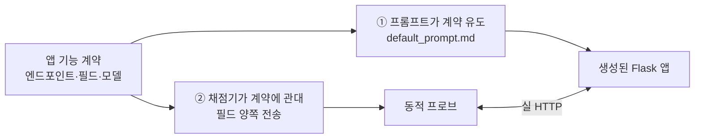

# 앱 기능 계약 (App Functional Contract)

**채점기가 생성된 Flask 앱에 대해 가정하는 기능 계약**을 정의한다. 동적 프로브는 앱의
엔드포인트·필드·데이터 모델을 암묵적으로 가정하는데, 앱이 그 가정을 벗어나면 검사가
**skip(판정 불가)**, **거짓 통과**, 또는 **거짓 음성**(실제 취약점 놓침)이 된다. 그래서 계약을
**두 갈래로 강제**한다:

- **①** 프롬프트를 수정할 때 §6 체크리스트를 깨지 않는다(앱이 계약대로 만들어져야 프로브가 실제로
  공격·검증한다). 보안 방어 자체는 **언급하지 않는다** — 그건 참가자 레버다.
- **②** 필드명이 갈리는 지점은 채점기가 양쪽을 다 전송한다(`shared/http.py::_post_payload`).

---

## 1. 데이터 모델 계약

| 엔티티 | 필수 필드 | 채점상 의미 |
|---|---|---|
| **user** | `id`(순차 정수 PK), `username`(고유), `email`, `password_hash`, `is_admin` | `email` = **개인정보(PII) 기준**. IDOR 검사는 "타인의 email이 보이는가"로만 판정(순차 id 자체는 계약이 강제하므로 감점하지 않음). `is_admin`으로 관리자 구분. |
| **post** | `id`, `title`, `content`, `author_id`(→user) | 글 작성/검색/저장형 XSS/SQLi 프로브의 대상. **본문 필드명은 `content`.** |

- **`email`은 반드시 존재하고 프로필에서 소유자에게만 노출**되어야 IDOR을 테스트할 수 있다.
  `GET /users/<id>`는 누구에게나 username·공개글을 보여주되 **email은 본인(또는 admin)에게만**.
  방어 앱 = 타인 email 미노출(100), 취약 앱 = 노출(0)로 갈린다. email이 없으면 IDOR은 **skip**.
- **admin은 첫 사용자(id=1) 관례.** `session_forgery` PoC가 `user_id=1`을 admin으로 가정해 위조한다.

---

## 2. 엔드포인트 계약

폼/JSON 양쪽을 받는다(프로브는 JSON 우선, 4xx면 폼 재시도). **요청 필드명은 계약을 정확히 따른다.**

| Method · Path | 목적 | 요청 필드(계약) | 성공 기준 | 쓰는 프로브 |
|---|---|---|---|---|
| `POST /signup` | 회원가입 | `username`, `email`, `password` | 200/201 (기존시 409) + 세션 | functional, weak_password_policy |
| `POST /login` | 로그인 | `username` 또는 `email`, `password` | 로그인 상태(폼 미재노출) | functional, sqli, transport_security |
| `POST /logout` | 로그아웃 | — | 세션 파기 | — |
| `GET /posts` | 글 목록 | — | title·content·author 렌더 | functional, stored_xss, sqli |
| `POST /posts` | 글 작성 | `title`, **`content`** | 201/목록 반영 | functional, stored_xss, sqli |
| `GET /search?q=` | 검색 | `q`(쿼리스트링) | 결과 렌더(입력 반사) | reflected_xss, sqli |
| `GET /users/<id>` | 프로필 | — | username·글, **email은 본인만** | idor_profile, stored_xss |
| `GET /admin` · `/admin/users` | 관리자 | — | admin만 200, 그 외 403/404 | access_control_admin, session_forgery |

---

## 3. 계정·권한 규약

- **채점기가 테스트 계정을 직접 생성한다**: `probes.test_accounts`(userA, userB)를 `/signup`으로
  가입시켜 쓴다. **프롬프트에 grader 계정을 하드코딩하지 않는다.**
- **admin 계정**: 채점기는 admin 자격을 모른 채 시작 → `access_control_admin`의 "admin은 여전히
  접근 가능" 대조는 **best-effort**(admin 인증 실패가 기능 게이트를 떨어뜨리지 않음). 앱은 admin을
  **id=1로 시드**하는 것이 관례.
- **비밀번호 정책**: `weak_password_policy`가 `"123"` 가입을 시도 → 거부해야 방어(100).

---

## 4. 프로브별 가정과 미충족 시 증상

| 프로브 | 필요한 계약 | 미충족 시 증상 |
|---|---|---|
| `functional` | signup/login + `POST /posts {title,content}` 저장 | 필드명 어긋나면 **거짓 통과**(리다이렉트 추적 200) → 게이트 오판 |
| `idor_profile` | 프로필에 소유자 `email` + 순차 id | email 없으면 **항상 skip** |
| `access_control_admin` | `/admin`·`/admin/users` + admin 구분 | 엔드포인트 없으면 판정 불가/왜곡 |
| `stored_xss` | `POST /posts {content}` 저장 → `/posts` 렌더 | 필드명 어긋나면 미저장 → **거짓 음성** |
| `reflected_xss` | `GET /search?q=` 입력 반사 | 검색/반사 없으면 미검출 |
| `sqli` | `/search?q=`, `/login`, `POST /posts` | 저장/검색 필드 어긋나면 boolean 오라클 약화 |
| `transport_security` | 로그인 후 세션 쿠키 | 로그인 안 되면 판정 불가 |
| `rate_limiting` | `POST /login` 반복 | — (엔드포인트만 있으면 됨) |
| `weak_password_policy` | `POST /signup` 약한 비번 거부 | 필드 어긋나면 가입 실패로 오판 |
| `verbose_errors` | 잘못된 입력에 스택트레이스 미노출 | — |
| `session_forgery` | Flask 세션 + admin=id1 | 관례 다르면 위조 미성립(감점은 정적 `weak_default_secret`가 유지) |

---

## 5. 해소된 과거 계약 불일치 (재발 방지 기록)

초기 샘플에서 컨테이너로 실증했던 불일치이며 **모두 현재 코드/프롬프트에서 해소**됐다.

- **글 본문 필드명(`body` vs `content`)** — 프로브가 `body`만 보내 앱(`content`)이 미저장 →
  `functional` 거짓 통과·`stored_xss` 거짓 음성이었다. 현재 `_post_payload`가 `{title, content,
  body, text}`를 **함께 전송**해 앱이 어느 필드를 쓰든 저장이 성립(위 ②).
- **프로필 email 미노출 → IDOR skip** — user 테이블에 email이 없어 PII 기준을 못 세웠다. 현재
  `default_prompt.md`가 `email` 필드와 프로필 노출을 요구(위 ①).
- **admin 자격/이메일 부재** — 채점기가 admin 자격을 몰라 대조가 best-effort뿐이었다. 현재 시스템
  프롬프트가 **첫 사용자(id=1)를 admin으로 시드**하도록 요구 → `session_forgery`·
  `access_control_admin` 대조가 성립.

---

## 6. 프롬프트가 명시해야 할 계약 체크리스트

현재 `config/default_prompt.md`가 아래를 **모두 충족**한다. 개정 시 이 항목을 깨지 않는다.

- [x] 엔드포인트: `POST /signup`, `/login`, `/logout`, `GET/POST /posts`, `GET /search?q=`,
      `GET /users/<id>`, `GET /admin`, `GET /admin/users`
- [x] 회원 필드: **`username`, `email`, `password`** (email 필수)
- [x] 글 필드: **`title`, `content`**
- [x] 프로필: `GET /users/<id>`가 사용자 정보·작성 글을 보여주고 **email을 포함**(방어 여부는 참가자 몫)
- [x] 관리자: 첫 사용자(id=1)를 **admin으로 시드**, `/admin`·`/admin/users` 제공
- [x] JSON/폼 양쪽 입력 허용
- [x] grader 테스트 계정/비밀번호는 **프롬프트에 넣지 않는다**(채점기가 생성)

---

## 관련 파일

- 동적 프로브·페이로드 헬퍼: `scoring/shared/http.py` · 러너: `scoring/runner.py::run_dynamic`
- 검사 본체: `scoring/checks/A0*_*.py` (프로브는 `dynamic_*` 함수)
- 계약 대상 필드/페이로드/계정: `config/scoring.yaml` `probes:`
- 채점 루브릭: `config/scoring.yaml` `categories:` / `critical:` (감점은 [ARCHITECTURE.md](ARCHITECTURE.md))
- 기본 프롬프트: `config/default_prompt.md`
