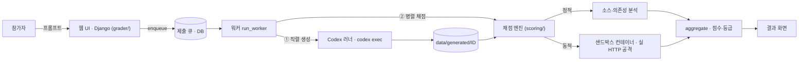
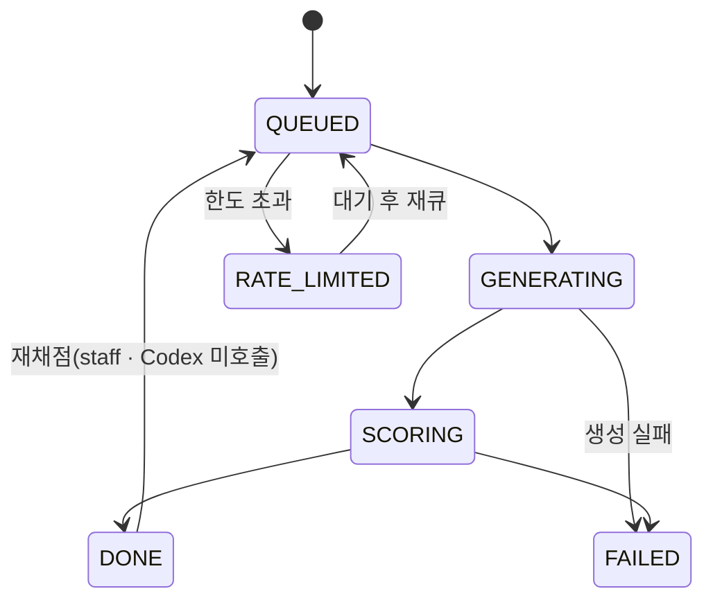
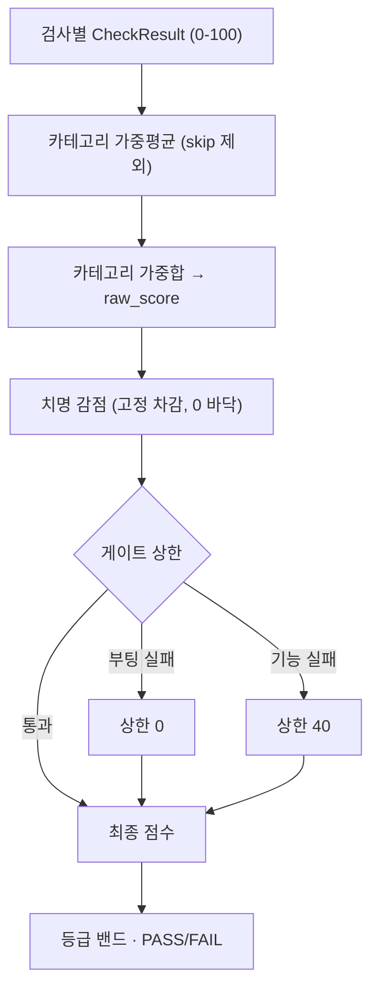

# vibe-security-score — 아키텍처

참가자가 프롬프트를 작성 → 서버가 **Codex CLI**(운영자 ChatGPT 로그인)로 **Flask 게시판 앱**을
생성 → 채점기가 격리 컨테이너에서 자동 채점 → UI가 점수/등급 표시. 참가자는 코드를 만지지 않는다.



## 고정 스택 (혼동 금지)

| 관심사 | 기술 | 비고 |
|---|---|---|
| 채점기 웹 / 큐 / 대시보드 | **Django** (`grader/`, 패키지 `grader/core/`) | 운영자 서버. 채점 엔진은 Django를 import하지 않음. |
| 참가자 생성 앱 | **Flask** | 채점 *대상*, Codex가 생성. |
| 참가자 앱 실행 | **`python:3.11-slim` 컨테이너** | 비루트(uid 10001), 메모리/CPU/pids 제한, 부팅 타임아웃. 네트워크는 켜둠. |

채점기 호스트와 참가자 Flask 환경은 **공유되지 않는다**: 참가자 `requirements.txt`(취약·타이포
가능)는 **컨테이너 안에서만** 설치된다.

## 프롬프트 모델 (시스템 + 참가자)

최종 프롬프트 = `시스템 프롬프트(고정) + "\n\n" + 참가자 프롬프트` (`submissions/views.py::_build_prompt`).

- **시스템 프롬프트** — `config/default_prompt.md`. 서버 고정 앱 계약(엔드포인트, `email` 포함
  사용자 필드, `id=1` 관리자, 게시글 `title`/`content`). 좌측 읽기 전용, 참가자 수정 불가.
- **참가자 프롬프트** — 자유 텍스트(우측). 실제 채점 레버.

스펙을 서버에 고정해 동적 프로브가 가정하는 앱 계약([APP_CONTRACT.md](APP_CONTRACT.md))을
참가자가 바꿀 수 없다.

## 네 파트

**1. 웹 UI (Django, `grader/`)** — `Submission` 모델 + 상태 머신. 모든 전이는
`submissions/state.py`를 경유(Submission을 바꾸는 유일한 곳).



참가자 흐름: 두 패널 제출 → 상태·큐 위치 폴링(`status_json`) → 결과(항목별 ✔/✘ + 감점 사유 +
등급, `rubric.category_groups` 구성). 공개 순위는 `/ranking/`(로그인 없이 열람). **실시간 생성
뷰**가 레닥션된 Codex 활동을 tail(`generation_events_json`). 운영자는 Django admin + 스태프 전용
**재채점** 버튼. 운영자 계정은 `accounts.Operator`(이메일 컬럼 없음 — 이메일은 참가자 앱 개념).

**2. Codex 러너 (`codex_runner/`)** — `runner.generate`가 `codex exec`(비대화형)를 구동, 프롬프트는
**stdin**으로 전달. `app.py`/`requirements.txt`/`templates/`를 `data/generated/ID/`로 하베스트하고
`prompt.md`를 기록. **ChatGPT 인증만** — `OPENAI_API_KEY`/`CODEX_API_KEY`를 비워 API 키 fallback
없음. 직렬 사용(5시간 롤링 한도), 실행별 타임아웃이 프로세스 트리를 종료. JSONL 스트림을 실시간
으로 읽어 `activity.py`가 **레닥션**(임시·호스트 경로, 명령 출력 제거)해 `events.jsonl`로 남긴다
(결과 페이지가 읽기 전용 tail). 원본 `transcript.json`은 운영자 전용.

**3. 채점 엔진 (`scoring/`)** — 순수 Python(Django 무의존), 단독 테스트 가능.
`grade.py::grade_submission` = 정적 + 동적 → `aggregate.combine_scores` → 리포트. 흐름은 **단일
등록부 → phase별 러너 → 검사(check)**.

- **등록부 (`registry.py`)** — 정적 검사·동적 프로브를 `Check(id, label, phase, fn)`로 **한 번씩**
  선언(OWASP 패밀리 순서). `by_phase("static"|"dynamic")`로 필터.
- **러너 (`runner.py`)** — `run_static`(오프라인, `StaticContext` 조립). `run_dynamic`(컨테이너에
  앱 부팅 후 `requests`로 공격): `functional`이 먼저 실행돼 게이트를 구동하고 세션/id를 시드
  (틀린 비밀번호 거부는 상태 코드가 아니라 **인증 상태**로 판정 — 폼 앱은 실패 시 로그인 폼을
  200으로 재렌더), 이어서 나머지 프로브, 마지막에 `A03_supply_chain.dynamic_cve`(컨테이너
  `pip freeze` 기준 전이 CVE 재측정). 판정 불가 검사는 0점이 아니라 **skip**(집계 제외).
- **검사 (`checks/`)** — OWASP 2025 패밀리별로 정적 검사 + 동적 프로브 + 등록을 한 파일에 둔다.
  파일명 = 패밀리 번호라 위치가 규칙적:

  | 파일 | 검사 |
  |---|---|
  | `A01_broken_access_control` | CSRF · SSRF · IDOR · 관리자 접근 |
  | `A02_security_misconfiguration` | debug · 보안 헤더 · 전송 보안 |
  | `A03_supply_chain` | CVE · 타이포스쿼팅 · 환각 패키지 · 전이 CVE |
  | `A04_cryptographic_failures` | 시크릿 · 해싱 · 쿠키 플래그 · 세션 위조 · gitleaks |
  | `A05_injection_sql` / `A05_injection_xss` | SQLi · 저장형/반사형 XSS · CSP |
  | `A06_insecure_design` | rate limiting |
  | `A07_authentication_failures` | 기능 게이트 · 약한 비번 정책 |
  | `A08_integrity_failures` | 안전하지 않은 역직렬화 |
  | `A09_logging_failures` | 보안 로깅 |
  | `A10_exceptional_conditions` | 상세 오류 노출 |
  | `sast` | semgrep (OWASP 무소속 · 리포트 전용) |

- **공용 (`shared/`)** — `http`(DynamicContext·Account·CSRF·응답 헬퍼), `sources`, `sandbox`,
  `external_tools`(osv/gitleaks/semgrep), `sqlmap`.
- **이름 규칙** — 정적 검사 `check_*`, 동적 프로브 `dynamic_*`, 컨텍스트 `StaticContext`/
  `DynamicContext`. 정적은 `fn(sctx, cfg)`, 동적은 `fn(ctx, cfg)`; 러너가 phase로 분기하고
  `functional`은 게이트 판정을 `CheckResult.passed`에 실어 균일하게 흐른다.

**4. 오케스트레이터 (`grader/submissions/orchestrator/`)** — 워커 하나(`run_worker`): **직렬 생성**
(전역 락 — 공유 ChatGPT 한도) → **제한된 병렬 채점**(`scoring_concurrency`). `process_one`이
**재채점 vs 생성**을 분기: `regrade_only` 제출은 기존 `workdir`를 재채점하며 **Codex를 호출하지
않는다**(코드가 없으면 실패). 재시도/백오프; rate-limit은 실패가 아니라 재큐잉; 인증 실패는 전역
운영자 알림. 시작 시 1회 고아 자원 스윕.

## 채점 계산

각 검사는 0–100. `aggregate.combine_scores`:



1. **카테고리 점수** = 카테고리 검사들의 가중 평균(skip 제외).
2. **최종** = 정규화된 카테고리 가중치로 가중, *존재하는* 카테고리에 재정규화(정적 단독 실행은
   정적만으로 채점). 이 시점 값이 `raw_score`.
3. **치명 감점** (`_apply_critical_penalties`) — 실패한 치명 검사는 최종에서 고정 점수를 *차감*
   (중첩, 0 바닥). 앱 전체를 노출시키는 결함은 평균에 희석되지 않는다:

   | 검사 | 감점 | 검사 | 감점 |
   |---|---|---|---|
   | `sqli` | −25 | `weak_default_secret` | −15 |
   | `debug_true` | −20 | `reflected_xss` | −12 |
   | `access_control_admin` | −20 | `csrf_protection` | −6 |
   | `stored_xss` | −18 | | |

   `session_forgery`(weight 0)는 증거를 `weak_default_secret`에 접어 넣는다(이중 계상 없음).
   각 감점은 결과 화면에 `severity` + `repro`를 동반.
4. **게이트 상한** (감점 *후* 천장): 부팅 실패 → `0`; 기능 게이트 실패(회원가입/로그인/글작성) → `40`.

**등급 밴드**: `미흡 ≥0` · `통과 ≥60` · `우수 ≥80` · `최고 ≥95`. PASS = 부팅/기능 실패 없음 **그리고**
최종 ≥ 60. 보안 항목은 채점 전 비공개(결과 화면 감점 사유로만 노출).

가중치·임계값·감점·상한·등급 컷은 모두 [`config/scoring.yaml`](../config/scoring.yaml) — **로직에
하드코딩 없음**. 8개 카테고리(가중치 합 100), 검사의 카테고리 재배치는 YAML 편집만으로 된다:

| 카테고리 | 가중치 | 카테고리 | 가중치 |
|---|---|---|---|
| `functional` | 20 | `xss` | 10 |
| `auth` | 15 | `security_config` | 10 |
| `sqli` | 15 | `dependencies` | 10 |
| `input_validation` | 10 | `ai_security` | 10 |

> 코드 위치(OWASP 패밀리, `checks/`)와 채점 버킷(config 카테고리)은 별개다. 집계는 파일 위치가
> 아니라 config 매핑을 따르므로 둘은 독립적이다.

## 샌드박스 (`sandbox/`)

`python:3.11-slim`, 비루트(uid 10001), 메모리/CPU/pids 제한, 네트워크 ON. `entrypoint.sh`가 앱을
쓰기 가능한 `/work` tmpfs로 복사하고 런타임 상태 파일(`*.sqlite3`/`*.db`)을 제거해 **매 채점을
clean state로** 시작한다(앱은 부팅 시 자체 DB 생성). `sitecustomize.py`가 `Flask.run`을 몽키패치해
`0.0.0.0:$APP_PORT`로 바인딩하고 reloader를 끈다 — 생성 앱은 흔히 `app.run(debug=True)`로
127.0.0.1에 바인딩해 Docker 포트맵으로 도달 불가하기 때문. `debug`는 유지해 디버그 페이지
취약점은 채점된다. `Sandbox.pip_freeze()`가 전이 CVE 재측정에 쓰인다.

## 저장소 레이아웃

```
config/scoring.yaml            # 단일 채점 설정 (로직에 하드코딩 없음)
config/default_prompt.md       # 고정 시스템 프롬프트(앱 스펙)
scoring/                       # 채점 엔진 (순수 python)
  grade.py                     # 진입점: 정적+동적 → 집계 → 리포트
  runner.py                    # run_static / run_dynamic (registry를 phase로 실행)
  registry.py                  # 모든 검사(Check) 단일 등록부 + by_phase()
  aggregate.py config.py models.py owasp.py cli.py
  checks/                      # OWASP 패밀리별 검사 (정적+동적+등록)
    base.py                    # Check 데이터클래스
    A01_broken_access_control … A10_exceptional_conditions   # 파일명 = 패밀리 번호
    A05_injection_sql / A05_injection_xss, sast(OWASP 무소속)
  shared/                      # http(DynamicContext)·sources·sandbox·external_tools·sqlmap
codex_runner/                  # codex exec 래퍼 + 활동 레닥션 (+ smoke.py dev 테스트)
grader/                        # Django 프로젝트(패키지 grader/core/); 앱: submissions, accounts
  submissions/orchestrator/    # DB 큐 백엔드 + 파이프라인 (run_worker가 구동)
sandbox/                       # Dockerfile + entrypoint.sh + sitecustomize.py
samples/vulnerable_board/      # 방어 얕은 Flask 앱 — 채점 픽스처(낮은 점수)
samples/secure_board/          # 하드닝 Flask 앱 — 채점 픽스처(높은 점수)
data/                          # 생성 앱 + codex 트랜스크립트 + 고정 스냅샷(OSV, 인기 패키지)
deploy/                        # 프로덕션: gunicorn + systemd + nginx
```

## 환경

프로덕션 = Ubuntu, 의존성 **uv**, 웹 gunicorn + systemd(nginx 뒤), **PostgreSQL**(병렬 채점 쓰기).
채점 도구(`osv-scanner`/`gitleaks`/`semgrep`/`sqlmap`)는 기본 모드 필수(`--dev`는 내장 오프라인
검사 대체 — 개발용). 배포 검증은 `samples/vulnerable_board/` 채점으로(심어둔 `SECRET_KEY`, IDOR,
저장형 XSS, 관리자 접근, SQLi가 모두 실점해야 정상). 전체 절차는 [deploy/README.md](../deploy/README.md).
